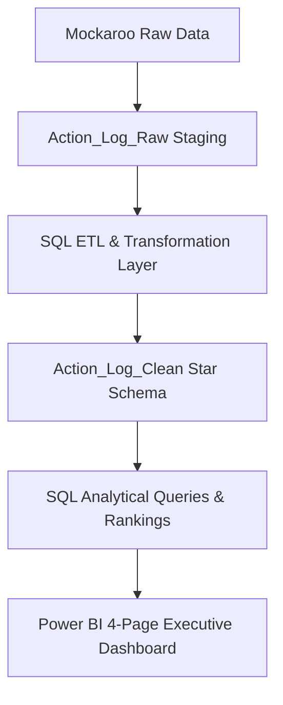

# 📊 Executive Strategic Initiatives & Operational Risk Analytics Platform

[](https://github.com/rashmileema-BI)
[](https://github.com/rashmileema-BI)
[](https://github.com/rashmileema-BI)

An enterprise-style analytics solution designed to monitor strategic initiatives, operational risks, project performance, and executive KPIs using SQL Server and Power BI. This platform simulates a real-world PMO (Project Management Office) and executive reporting environment.

---

## 🎯 Project Overview

Organizations manage hundreds of strategic initiatives across Finance, IT, Sales, HR, and Operations. Executive leadership requires centralized visibility into:

* Project completion percentages and delivery timelines
* Operational bottlenecks and dependency-related delays
* High-risk initiatives requiring immediate executive escalation
* Departmental efficiency scoring and performance rankings
* Resource constraints and budget variances

---

## 🛠️ Tech Stack

| Tool | Purpose |
| :--- | :--- |
| **SQL Server** | Relational database management, data staging, and schema design |
| **SSMS** | T-SQL ETL transformations, Views, and analytical query development |
| **Power BI** | Multi-page executive dashboard suite and interactive KPI drill-throughs |
| **Mockaroo / Excel** | Synthetic enterprise operational log generation and ingestion |

---

## 📐 Pipeline Architecture & Database Structure



### Table Definitions

* **`Action_Log_Raw`**: Contains imported raw operational records and transactional logs.
* **`Action_Log_Clean`**: Enriched production table (via view) with standardized names, computed duration metrics, and business logic flags.

---

## ⚙️ SQL ETL & KPI Engineering

The ETL layer standardizes and enriches operational data for analytical consumption:

* Standardized departmental text keys using `UPPER()` and `TRIM()`.
* Engineered duration metrics (`Days_Remaining`) using `DATEDIFF()`.
* Built multi-tier `CASE` logic classifying `Project_Health` (On Track, At Risk, Critical, Delayed).
* Established business rules for automated executive `Escalation_Status`.

---

## 💻 Sample SQL Analytics: Departmental Performance Ranking

```sql
SELECT
    Business_Function,
    COUNT(Initiative_ID) AS Total_Initiatives,
    AVG(Completion_Pct) AS Avg_Completion_Pct,
    SUM(CASE WHEN Escalation_Status = 'Escalated' THEN 1 ELSE 0 END) AS Escalated_Count,
    SUM(CASE WHEN Project_Health = 'Delayed' THEN 1 ELSE 0 END) AS Delayed_Count,
    RANK() OVER(ORDER BY AVG(Completion_Pct) DESC) AS Performance_Rank
FROM vw_Action_Log_Clean
GROUP BY Business_Function;
```

---

## 📊 Power BI Dashboard Suite

The interactive Power BI report consists of 4 dedicated pages:

1. **Executive Overview Dashboard**: Global KPI scorecards, initiative status breakdown, risk distribution, and overall progress monitoring.
2. **Operational Performance Dashboard**: Departmental benchmarking, initiative owner workload analysis, and function-level completion tracking.
3. **Risk & Escalation Dashboard**: Critical path visibility, overdue project tracking, and dependency impact analysis.
4. **Strategic Insights Dashboard**: Priority vs. completion scatter matrices, project health trendlines, and decision-support modeling.

---

## 📁 Repository Structure

```
├── sql/
│   └── executive_analytics_queries.sql   # Complete ETL views, rankings, and CTE queries
├── data/
│   └── synthetic_action_log.csv          # Ingested operational logs
└── README.md
```
