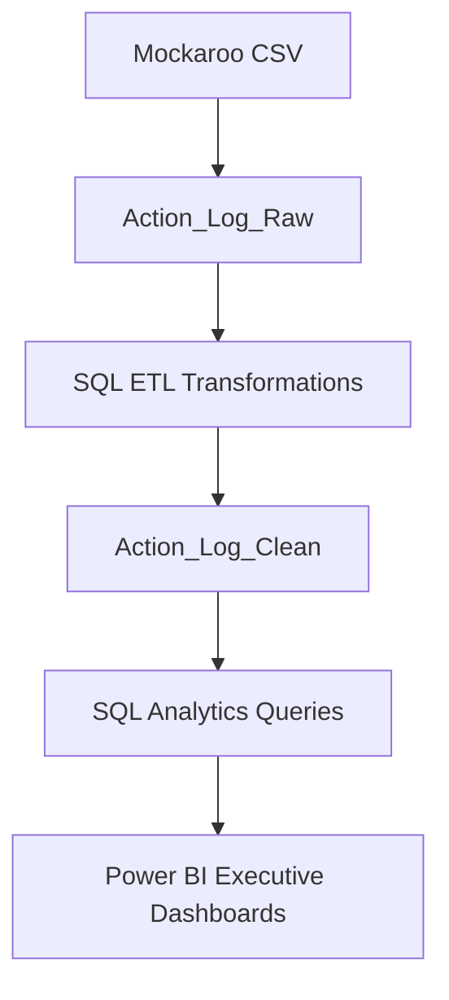

# Executive-Strategic-Initiatives-Analytics-Platform

An enterprise-style analytics solution designed to monitor strategic initiatives, operational risks, project performance, and executive KPIs using SQL Server and Power BI. This project simulates a real-world PMO (Project Management Office) and executive reporting environment by transforming raw operational data into actionable business insights through ETL processes, KPI engineering, advanced SQL analytics, and interactive dashboards.

---

### Project Overview

Organizations manage hundreds of strategic initiatives across departments such as Finance, IT, Sales, HR, and Operations.

Executive leadership requires centralized visibility into:

* Project completion rates
* Operational bottlenecks
* High-risk initiatives
* Escalated projects
* Departmental performance
* Resource constraints
* Dependency-related delays

This project was built to simulate an enterprise operational analytics environment and demonstrate end-to-end business intelligence workflows.

---

### Tech Stack

| Tool        | Purpose                              |
| ----------- | ------------------------------------ |
| SQL Server  | Database management & ETL            |
| SSMS        | SQL development                      |
| Power BI    | Dashboarding & visualization         |
| Mockaroo    | Synthetic enterprise data generation |
| Excel / CSV | Raw data source                      |

---

### Architecture



### Database Structure

#### Database

Strategic_Initiatives_DB

#### Tables

| Table            | Description                                                          |
| ---------------- | -------------------------------------------------------------------- |
| Action_Log_Raw   | Contains imported raw operational data                               |
| Action_Log_Clean | Contains transformed analytics-ready data with engineered KPI fields |

---

### ETL Transformations

The ETL layer was developed using SQL Server to standardize, enrich, and prepare operational data for reporting and analytics.

#### Key Transformations

* Standardized department names using UPPER()
* Engineered Days_Remaining using DATEDIFF()
* Created Escalation_Status business logic
* Classified projects into Project_Health categories
* Structured analytics-ready reporting tables
* Applied enterprise-style KPI engineering

---

### SQL Concepts Demonstrated

#### Aggregations

* COUNT()
* AVG()
* SUM()
* GROUP BY

#### CASE Statements

Used for:

* Project health classification
* Escalation logic
* KPI categorization

#### Common Table Expressions (CTEs)

Used for:

* Department performance analysis
* Underperforming business unit identification

#### Window Functions

Implemented:

* RANK()
* Department performance ranking

#### Date Functions

Implemented:

* DATEDIFF()
* Overdue project analysis

---

### Key Business KPIs

The platform tracks:

* Total Strategic Initiatives
* Average Completion %
* Delayed Projects
* Escalated Projects
* High-Risk Initiatives
* Department Performance Rankings
* Dependency Bottlenecks
* Operational Efficiency Metrics

---

### Power BI Dashboard Pages

#### 1. Executive Overview Dashboard

**Features**

* KPI Cards
* Initiative Status Breakdown
* Risk Distribution Analysis
* Strategic Initiative Progress Monitoring
* Executive-Level Performance Summary

---

#### 2. Operational Performance Dashboard

**Features**

* Department Performance Comparison
* Initiative Owner Analysis
* Completion Percentage Tracking
* Function-Level Performance Monitoring
* Operational Efficiency Insights

---

#### 3. Risk & Escalation Dashboard

**Features**

* Escalated Initiative Tracking
* High-Risk Initiative Monitoring
* Overdue Project Analysis
* Dependency Impact Assessment
* Critical Initiative Visibility

---

#### 4. Strategic Insights Dashboard

**Features**

* Priority vs Completion Analysis
* Project Health Evaluation
* Delay Trend Monitoring
* Business Function Performance Analysis
* Strategic Decision-Support Visualizations

---

### Example Business Questions Solved

* Which departments have the highest operational efficiency?
* Which initiatives require executive escalation?
* What dependencies cause the most project delays?
* Which projects are considered high-risk?
* Which departments are underperforming?
* What is the organization-wide completion rate?

---

### Sample SQL Analytics

#### Department Performance Ranking

```sql
SELECT
    Business_Function,
    AVG(Completion) AS Avg_Completion,
    RANK() OVER(
        ORDER BY AVG(Completion) DESC
    ) AS Performance_Rank
FROM Action_Log_Clean
GROUP BY Business_Function;
```

---

#### Power BI Features Used

* KPI Cards
* Donut Charts
* Clustered Bar Charts
* Matrix Tables
* Slicers
* Interactive Cross-Filtering
* Conditional Formatting
* Drill-Through Navigation
* Executive Dashboard Design
* Dynamic Visual Interactions

---

#### Skills Demonstrated

**Data Engineering**

* ETL Design
* Data Cleaning
* Data Transformation
* KPI Engineering

**SQL**

* Advanced Querying
* CTEs
* Window Functions
* CASE Statements
* Aggregations

#### Business Intelligence

* Dashboard Development
* Executive Reporting
* Data Storytelling
* KPI Visualization

---
